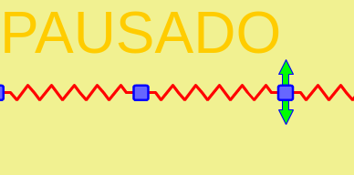
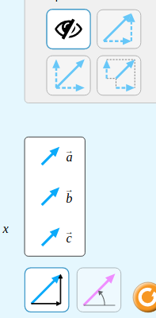
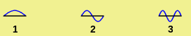
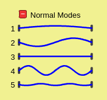
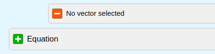
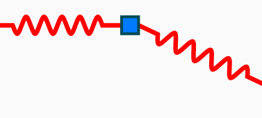

# Lista de afazeres

## Geral

- [x] Consertar indentação do optionspanel e ampphasemodel e colocar a frequência entre a amplitude e a fase (como na original)

- [ ] ~~Fazer aparecer texto escrito "Pausado" quando a simulação estiver pausada (Franco: isso tem em outras simulações HTML5?~~ (talvez fique meio feio, e já tem o botão para indicar se está pausado ou não)

- [x] Fazer aparecerem flechas sobre as massas quando o mouse passar por cima (sendo que deixam de aparecer logo após qualquer massa ter sido arrastada) - pode ter como guia as mesmas flechas que aparecem na chave inglesa do Wave On A String

Ilustração dos dois itens anteriores:

## Parte Unidimensional

- [x] Criar um elemento na interface que controle a direção do movimento (horizontal ou vertical) - ao invés de usar um radio button comum como na simulação antiga, seria possível usar botões com imagem como feito atualmente (exemplo da imagem a seguir vem da simulação Vector Addition, também são do tipo em que só pode haver um selecionado por vez)
  
  

- [x] Desenhar sobre cada modo normal uma coisa como essa (da original):
  
  

- [x] Desenhar para cada modo normal uma coisa como essa, que muda com o tempo, fase e amplitude:

  

- [x] (Feito mas falta a coisa de cima) Fazer com que o painel com as amplitudes e fases e também as coisas do item anterior possam ser escondidas por meio de um botão como o retratado na imagem anterior - isso já foi feito em novas simulações obviamente mais bonitamente (imagem de exemplo novamente da linda simulação Vector Addition)

  

## Parte Bidimensional

- [x] Começar com 2x2 massas ao invés de 3x3

- [ ] Fazer o painel com controles de amplitude dos modos normais

- [ ] Adicionar a possibilidade de se arremessar a massa com o mouse (como é possivel na original) - é possivel fazer isso sem alterar o modelo 2D, adicionando uma velocidade na massa quando for solta, no endCallback (calculando a velocidade com as últimas duas posições do mouse e o tempo entre elas)

## Coisas extras

- [ ] Separar o MassNode em MassNode1D e MassNode2D ou **algo** equivalente, porque no momento está **muito** feio (tando o startCallback, o dragCallback e o endCallback mudam de um pro outro) - o **importante** aqui é deixar não feio

- [ ] Traduzir simulação para português?

- [ ] Mudar as cores totalmente para que a nossa não fique feia como a simulação original?

- [ ] Se assegurar de que a **performance** não esteja ruim!

- [ ] Talvez melhorar os controles 2D (procurar inspiração em outras simulações?)

- [ ] Desenhar molas mais bonitas (ao invés de só uma linha como atualmente ou algumas linhas retas como na original) - uma possibilidade seria fazer como eu fiz na minha própria simulação (foram feitas várias tentativas mas todas com má performance, seria necessário estudar mais o caso e ver se o problema somos nós ou eles):

  